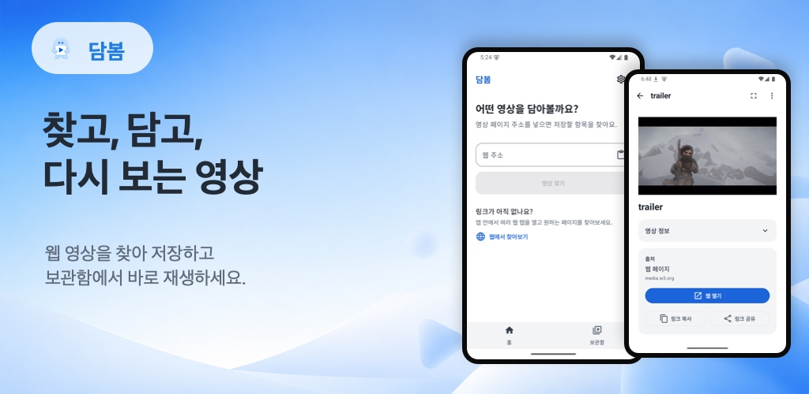
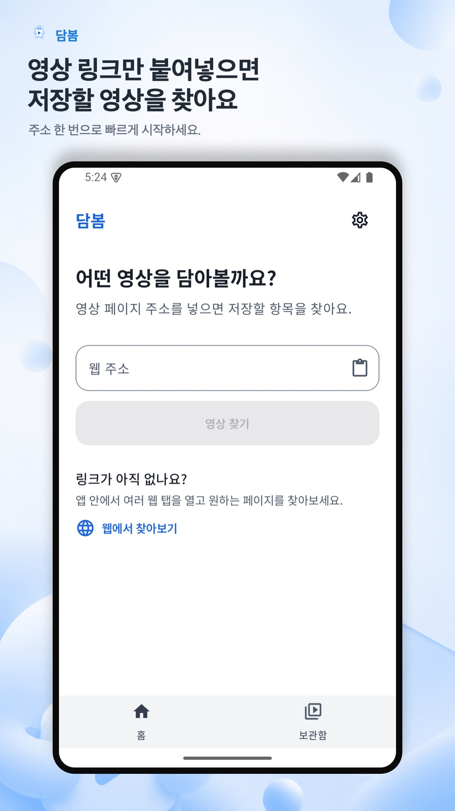
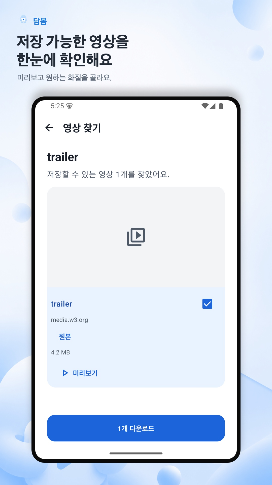
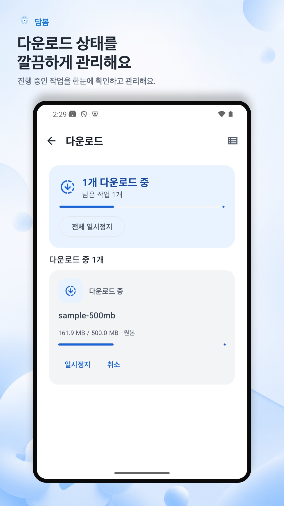
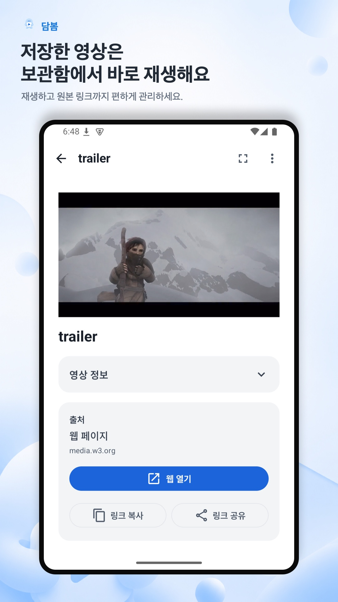

# 담봄 Dambom

**다시 보고 싶은 영상, 링크로 담아두세요.**

웹과 X(트위터)에서 찾은 영상을 저장하고, 나만의 보관함에서 다시 보는 Android 앱입니다.

## 주요 기능

### 링크에서 영상 찾기

영상이 있는 페이지 주소를 붙여넣거나 다른 앱에서 링크를 담봄으로 공유해 시작하세요. 링크가 없어도 앱 안의 웹 브라우저에서 여러 탭을 열어 페이지를 찾아볼 수 있어요.

### 미리 보고 원하는 화질로 저장

찾은 영상의 썸네일과 미리보기를 확인하고 저장할 영상을 골라보세요. 여러 영상을 함께 선택할 수 있고, 여러 화질이 제공되는 영상은 원하는 화질을 선택해 내려받을 수 있어요.

<table>
  <tr>
    <th>링크 입력</th>
    <th>영상 선택</th>
  </tr>
  <tr>
    <td></td>
    <td></td>
  </tr>
</table>

### 다운로드를 한눈에 관리

진행률과 남은 작업을 확인하고, 다운로드를 일시정지하거나 다시 이어받을 수 있어요. 전체 일시정지와 재개, 개별 취소, 실패한 다운로드 재시도도 지원해요. 저장이 끝난 영상은 보관함에서 확인하세요.

### 보관함에서 다시 보기

저장한 영상을 검색하거나 X와 웹 출처별로 모아보세요. 앨범과 목록 중 편한 보기 방식을 선택하고, 내장 플레이어로 오프라인에서도 재생할 수 있어요.

- 전체화면 재생과 앞뒤 10초 이동
- 전체화면에서 재생 중 다른 앱으로 이동할 때 작은 창으로 이어 보는 PiP
- 원본 페이지 열기, 링크 복사와 공유, 영상 파일 공유와 내보내기
- 여러 영상을 선택해 한 번에 삭제

<table>
  <tr>
    <th>다운로드 관리</th>
    <th>저장한 영상 재생</th>
  </tr>
  <tr>
    <td></td>
    <td></td>
  </tr>
</table>

이미지는 1.0.0 스토어 소개용 화면으로, 현재 앱의 화면 구성과 일부 다를 수 있습니다.

## 지원 범위

- Android 8.0 이상에서 사용할 수 있습니다.
- 사용자가 저장 권한을 가진 공개 비-DRM 영상과 공개 X 게시물의 MP4 영상을 지원합니다.
- 사이트와 영상 형식에 따라 감지와 다운로드가 제한될 수 있습니다. DRM, 유료 콘텐츠, 로그인 또는 접근 제한을 우회하지 않습니다.

## 기술 스택

| 영역 | 사용 기술 |
| --- | --- |
| 언어 | Kotlin |
| UI와 화면 이동 | Jetpack Compose, Navigation 3 |
| 비동기와 상태 관리 | Coroutines, Flow, ViewModel, StateFlow |
| 의존성 주입 | Hilt |
| 네트워크 | OkHttp, Kotlinx Serialization |
| 데이터 저장 | Room, DataStore |
| 다운로드 작업 | WorkManager |
| 영상 재생 | Media3 |

## 아키텍처와 모듈 구성

화면, 도메인, 데이터 구현을 분리한 멀티 모듈 구조입니다. 화면은 ViewModel의 `StateFlow`를 구독하고 사용자 동작을 ViewModel로 전달합니다. Repository 인터페이스는 `core:domain`에, 실제 다운로드와 저장 처리는 `core:data`에 두고 Hilt로 연결합니다.

| 모듈 | 역할 |
| --- | --- |
| `app` | 앱 진입점과 의존성 조립 |
| `presentation` | 앱 공통 화면 구성과 기능별 내비게이션 연결 |
| `feature:*` | 홈, 영상 감지, 웹 탐색, 다운로드, 보관함, 설정 |
| `core:domain` | 도메인 모델과 Repository 인터페이스 |
| `core:data` | Repository 구현과 다운로드 작업 관리 |
| `core:network`, `core:database`, `core:datastore` | 네트워크 통신, 로컬 DB, 사용자 설정 저장 |
| `core:designsystem`, `core:common-ui` | 공통 테마와 UI 컴포넌트 |
| `core:navigation`, `core:navigation-contract` | 화면 이동 처리와 경로 정의 |
| `build-logic` | 모듈에서 함께 사용하는 Gradle Convention Plugin |

### 주요 모듈 의존성

공통 유틸리티와 테스트 의존성을 제외한 주요 연결입니다. 왼쪽 모듈이 오른쪽 모듈을 참조합니다.

| 참조하는 모듈 | 주요 의존 모듈 |
| --- | --- |
| `app` | `presentation`, `core:data`, `core:network`, `core:analytics`, `core:navigation` |
| `presentation` | `feature:*`, `core:domain`, 공통 UI·내비게이션 모듈 |
| `feature:*` | `core:domain`, 공통 UI·내비게이션 모듈 |
| `core:data` | `core:domain`, `core:network`, `core:database`, `core:datastore` |
| `core:navigation` | `core:navigation-contract` |

기능 모듈끼리는 직접 참조하지 않으며, `presentation`에서 연결합니다. `core:domain`은 Android 플러그인을 사용하지 않는 Kotlin/JVM 모듈로, UI와 데이터 구현에 의존하지 않습니다.
