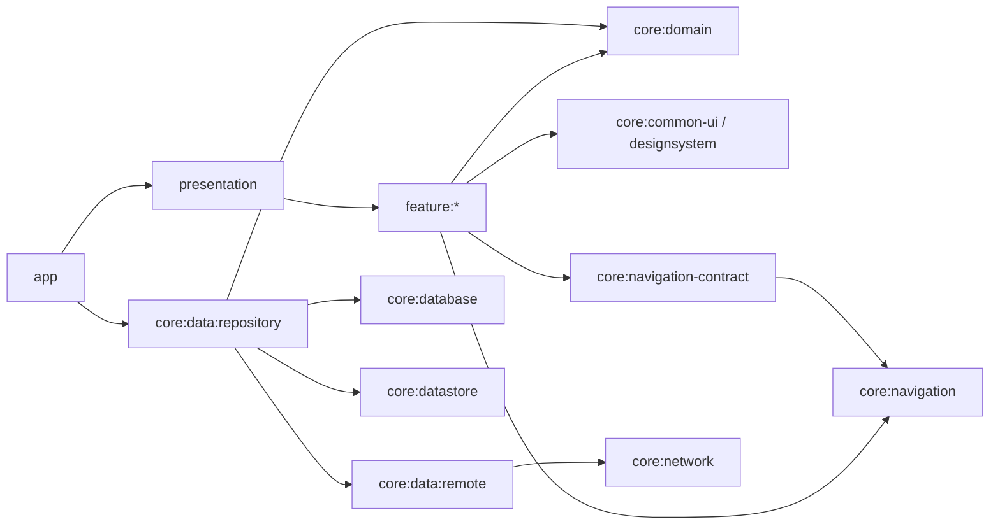

# Architecture

## 기준

이 템플릿은 첨부된 Presentation, Domain, Data, Remote/Cache 경계와 [Now in Android Architecture](https://github.com/android/nowinandroid/blob/main/docs/ArchitectureLearningJourney.md), [Now in Android Modularization](https://github.com/android/nowinandroid/blob/main/docs/ModularizationLearningJourney.md)을 함께 적용합니다.

레거시 MVP의 `Contract`, `Presenter`, `BaseObserver`를 그대로 만들지 않습니다. Compose UI, ViewModel, immutable UI state, Kotlin Flow와 단방향 데이터 흐름으로 같은 책임을 구현합니다.

## 모듈 구조



- `app`: Application, 패키징, Data 구현 연결과 최종 DI composition root
- `presentation`: Activity, 앱 scaffold, 최상위 Navigation 조립, 시스템 바와 화면별 UI 정책
- `feature:*`: 화면별 Route, stateless Screen, Presentation 상태와 ViewModel
- `core:domain`: Android에 독립적인 model, repository 계약, use case
- `core:data:repository`: repository 구현, source 선택과 동기화, Data와 Domain mapper
- `core:data:remote`: remote data source 계약과 구현, API DTO와 network model mapper
- `core:network`: OkHttp, Retrofit, JSON, interceptor와 service factory
- `core:database`: Room database, DAO, entity와 migration
- `core:datastore`: Preferences DataStore와 비정형 로컬 설정
- `core:common-ui`, `core:designsystem`: feature가 공유하는 UI 기반과 디자인 시스템
- `core:navigation`: 앱 destination을 모르는 navigation 상태, 이벤트와 명령 처리 엔진
- `core:navigation-contract`: feature 간에 공유하는 앱 destination key와 deep link 계약

`presentation`은 `core` 하위가 아닌 최상위 앱 셸 모듈입니다. 화면별 Presentation 로직은 Now in Android처럼 feature가 소유하고, `presentation`은 여러 feature를 조립하는 Activity와 앱 수준 UI만 소유합니다. 여러 feature에서 재사용되는 코드는 적절한 core 모듈로 승격합니다.

## 첨부 구조 대응

| 개념 | 템플릿 구현 |
|---|---|
| Activity, View | `presentation:MainActivity`, feature의 stateless Screen |
| Contract | feature의 `UiState`, callback 또는 Intent, Effect |
| Presenter implementation | feature의 Hilt ViewModel |
| Presentation model mapper | Domain model의 `toUiModels()` |
| Use case interface/implementation | `core:domain`의 invokable use case와 repository 계약 |
| Repository implementation | `core:data:repository:DefaultSampleRepository` |
| Data source interface/implementation | `SampleRemoteDataSource`와 Retrofit 구현, Room `SampleDao` |
| Remote model/mapper | `SampleResponse -> NetworkSample` |
| Cache model/mapper | `NetworkSample -> SampleEntity -> Domain Sample` |
| API service/service factory | `SampleApi`, `core:network`의 Retrofit provider |
| Database | Room `AppDatabase`, Entity, DAO와 migration |
| Base Observer | 별도 class 없이 Flow, `stateIn` 또는 lifecycle-aware collect 사용 |

## 데이터 흐름

```text
User event
  -> Feature ViewModel
  -> Domain UseCase
  -> Repository interface
  -> DefaultSampleRepository
  -> SampleRemoteDataSource
  -> SampleApi
  -> SampleResponse
  -> NetworkSample
  -> SampleEntity / Room
  -> SampleDao Flow
  -> Domain Sample
  -> SampleUiModel / UiState
  -> Compose UI
```

조회는 Room을 local source of truth로 사용합니다. refresh는 remote 결과를 local 저장소에 반영할 뿐이며, UI는 repository가 노출하는 local Flow의 변경을 관찰합니다. remote 실패 시 기존 cache는 유지됩니다.

`core:database`가 Room의 `AppDatabase`, Entity, DAO와 migration을 함께 소유하고 `core:data:repository`가 DAO를 직접 주입받습니다. Now in Android와 Pokedex처럼 스키마 소유 모듈을 하나로 두어 `database -> local -> database` 순환 의존성을 만들지 않습니다. Repository 공개 계약과 Domain에는 Room 타입을 노출하지 않습니다. 별도 local data source는 Room 외 구현이 실제로 추가될 때만 도입합니다.

Room 소유권과 단방향 의존성은 [Database](DATABASE.md), Retrofit과 RemoteDataSource 구성은 [Networking](NETWORKING.md), 계층별 오류 변환과 공통 처리 정책은 [Error Handling](ERROR_HANDLING.md)을 참고합니다.

## 계층 규칙

- Domain은 Android, Navigation, Retrofit DTO, Room entity를 참조하지 않습니다.
- Repository 구현은 Remote의 network model과 Room entity를 경계에서 변환하지만 공개 계약으로 노출하지 않습니다.
- Remote는 serialization과 Retrofit 오류를 자체 오류 계약으로 변환합니다.
- `core:database`는 Room schema, DAO, Entity와 transaction을 소유합니다.
- Feature는 Data 구현 모듈을 직접 참조하지 않고 Domain 계약과 use case만 사용합니다.
- Core 모듈은 feature, app 또는 앱 전용 destination 계약에 의존하지 않습니다.
- 이벤트는 아래로 전달하고 상태 데이터는 Flow를 통해 위로 전달합니다.

## Snackbar 이벤트와 Edge-to-edge

`core:common-ui`의 `SnackbarEventBus`는 feature ViewModel이 `SnackbarEvent`를 발행하는 단일 소비 이벤트 버스입니다. `presentation`의 단일 collector가 `SnackbarHostState`를 소유하고 메시지를 순서대로 표시하므로 feature는 Material snackbar 구현에 의존하지 않습니다. Retry처럼 화면 작업을 실행하는 action은 전역 이벤트에 callback을 싣지 않고 해당 화면의 state와 callback으로 처리합니다.

모든 Activity는 `setContent` 전에 `enableEdgeToEdge()`를 호출합니다. 앱 `Scaffold`는 `WindowInsets.safeDrawing`으로 계산한 `innerPadding`을 `LocalAppScaffoldPadding`으로 전달하고 각 화면이 자신의 레이아웃 특성에 맞게 소비합니다.

- 일반 화면: `Modifier.appScaffoldPadding()`
- 스크롤 화면: `LazyColumn.contentPadding = appPadding`과 `consumeWindowInsets`
- 전체 화면: 바깥 배경은 패딩 없이 시스템 바 뒤까지 그리고 조작 영역에만 `safeDrawingPadding()`
- 이미지와 영상 화면: 필요한 경우에만 `StatusBarProtection` gradient 사용

전역 상태 바 배경 overlay는 두지 않습니다. 일반 화면은 `Scaffold`, app bar 화면은 `TopAppBar`, 전체 화면은 화면 콘텐츠가 투명 시스템 바 뒤의 배경을 소유합니다. `AppChrome`은 실제 배경을 기준으로 시스템 바 아이콘 명암만 결정합니다.

화면 유형별 코드 예제와 상태 바/본문 색이 다른 경우의 적용 기준은 [Edge-to-edge](EDGE_TO_EDGE.md)를 참고합니다.

## 공통 Modifier

여러 feature에서 의미와 구현이 동일한 Modifier만 `core:common-ui`에 둡니다.

- `appScaffoldPadding()`: 일반 화면에 앱 Scaffold 패딩을 적용하고 해당 window inset을 소비합니다. `LazyColumn` 같은 스크롤 컨테이너는 이 Modifier 대신 `contentPadding`을 사용합니다.
- `throttledClickable()`: 기본 500ms 동안 연속 클릭을 무시합니다. 기본 `clickable`의 리플, role과 접근성 semantics를 유지하며 시간 비교에는 시스템 시간 변경의 영향을 받지 않는 monotonic clock을 사용합니다.

```kotlin
ListItem(
    modifier = Modifier.throttledClickable { onItemClick(item.id) },
    headlineContent = { Text(item.title) },
)
```

`Button`, `IconButton`처럼 자체 클릭 처리를 가진 컴포넌트에는 중첩 클릭 영역을 만드는 `throttledClickable()`을 붙이지 않습니다. 결제나 저장처럼 결과 중복 자체를 막아야 하는 작업은 UI throttle에만 의존하지 않고 ViewModel 또는 repository에서도 실행 중 상태와 idempotency를 보장합니다.

## Presentation

Route는 ViewModel 획득, lifecycle-aware state 수집과 일회성 effect 처리를 담당합니다. Screen은 state와 callback만 받는 stateless Composable로 유지해 Preview와 UI 테스트에서 ViewModel 없이 사용할 수 있습니다. ViewModel은 use case와 repository Flow를 UI state로 변환합니다. 각 feature의 `navigation` 패키지는 `EntryProviderScope` 확장만 제공하고, Navigation 요청은 `NavigationEvent`로 분리해 presentation의 단일 collector만 back stack을 변경합니다.

`core:common-ui`는 BaseViewModel, `UiState`/`UiIntent`/`UiEffect` marker와 MVI base, 앱 이벤트, lifecycle-aware effect 수집, adaptive width 분류와 Preview provider를 제공합니다. Loading/Success/Error 데이터 래퍼는 marker와 구분되는 `AsyncUiState<T>`를 사용합니다. 특정 화면의 State, Intent, Effect와 UI mapper는 해당 feature에 남깁니다.

## Build Logic과 DI

Version Catalog는 버전과 alias만, convention plugin은 plugin 조합과 공통 설정만 소유합니다. Retrofit, Room, DataStore는 feature convention에 포함하지 않습니다. Hilt는 app을 composition root로 사용하고 각 구현 모듈은 자신의 provider 또는 binding만 제공합니다.
